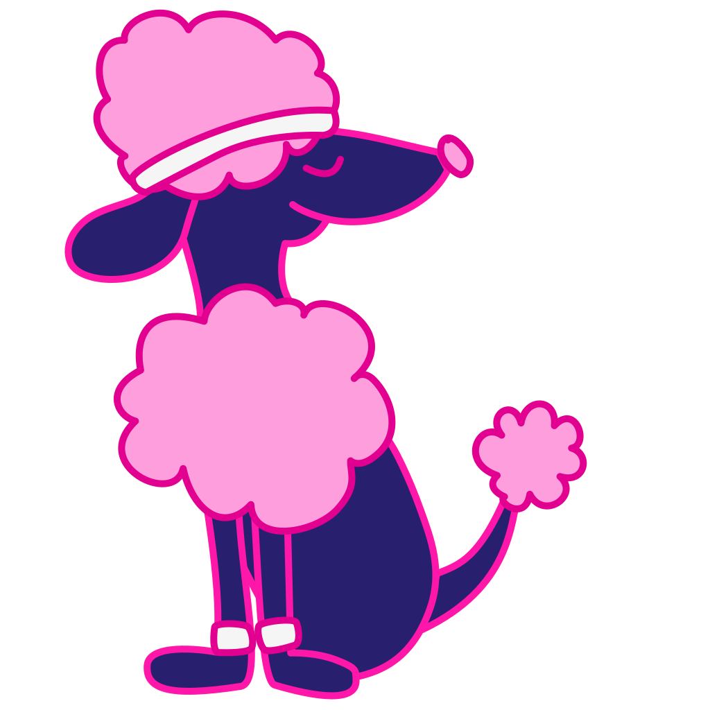
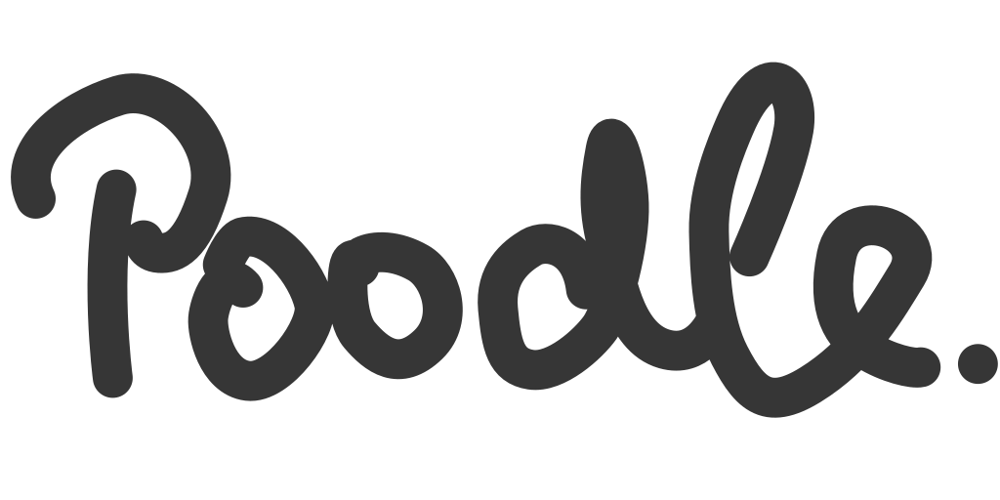

#  

Poodle is a scheduling tool.

This repository contains the SPA frontend implemented in vue.


## Based on

 - https://github.com/rti/vue2-webpack4-bulma-frontend
 
 
 ## How to use

Install yarn

### Install dependencies

```shell
yarn install
```

### Start development mode

```shell
yarn run start-dev
```

Direct your browser to http://127.0.0.1:9000

### Build production

```shell
yarn run build-prod
yarn run serve
```

Direct your browser to http://127.0.0.1:9000
